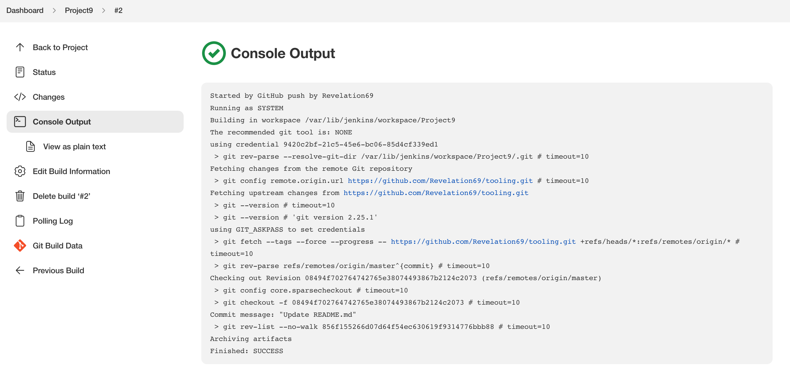

# TOOLING WEBSITE DEPLOYMENT AUTOMATION WITH CONTINUOUS INTEGRATION. 

The Purpose of this project is to enhance the architecture prepared in Project 8 by adding a Jenkins server, configure a job to automatically deploy source codes changes from Git to NFS server.

Here is how the updated architecture will look like upon competion of this project:


### INSTALL AND CONFIGURE JENKINS SERVER

- Created an AWS EC2 server based on Ubuntu Server 20.04 LTS and named it "Jenkins"

```
sudo apt update
```

- Installed JDK (since Jenkins is a Java-based application) with the command below:
```
sudo apt install default-jdk-headless 
```


- Installed Jenkins
```
wget -q -O - https://pkg.jenkins.io/debian-stable/jenkins.io.key | sudo apt-key add -
sudo sh -c 'echo deb https://pkg.jenkins.io/debian-stable binary/ > \
    /etc/apt/sources.list.d/jenkins.list'
sudo apt update
sudo apt-get install jenkins
```

- Verified that jekins is up and running
```
sudo systemctl status jenkins
```


- Opened port 8080  by creating a new Inbound Rule in my EC2 Security Group.

- Performed initial Jenkins setup.

    - Accessed http://<Jenkins-Server-Public-IP-Address-or-Public-DNS-Name>:8080 from my browser


- Retrived the password from the server using:

```
sudo cat /var/lib/jenkins/secrets/initialAdminPassword
```

- After inputing the password there is another prompt asking which plugins to install


- clicked installl suggested plugins
- After the plugins were installed created an admin user and extracted the jekins server address


*the above image shows that jekins installation is complete*

### Configure Jenkins to retrieve source codes from GitHub using Webhooks

- Enabled webhooks in my GitHub repository settings


- From the jekins web console, clicked "New Item" and created a "Freestyle project"

- In configuration of the Jenkins freestyle project choose Git repository, provide there the link to my Tooling GitHub repository and credentials (user/password) so Jenkins could access files in the repository.


- clicked the build now button


*the image above shows that the build ran successfully. However, this build does not produce anything and it runs only when we trigger it manually.*

- we want it to run automatically.

- Clicked "Configure" your job/project 
- then i clicked on build triggers and ticked  GitHub hook trigger for GITScm polling option.


- then clicked on post-build action to archive all the files – files resulted from a build are called "artifacts".


- Then i made a change on the Read.me file in my github repository and commit the changes. Automatically a build was launched by webhook which the artifacts were saved on jekins server. 




*the image above shows that we have succesfully configured an automated Jenkins job that receives files from GitHub by webhook trigger (this method is considered as ‘push’ because the changes are being ‘pushed’ and files transfer is initiated by GitHub). There are also other methods: trigger one job (downstreadm) from another (upstream), poll GitHub periodically and others.*

- By default, the artifacts are stored on Jenkins server locally 

```
/var/lib/jenkins/jobs/tooling_github/builds/<build_number>/archive/
```

### CONFIGURE JENKINS TO COPY FILES TO NFS SERVER VIA SSH

- The artifacts are saved locally on Jenkins server, the next step is to copy them to our NFS server to /mnt/apps directory.

- Install "Publish Over SSH" plugin" from the Manage Jenkins and select Manage Plugins under System Configuration.

- Configured the project to copy artifacts over to NFS server. On main dashboard select “Manage Jenkins” and choose “Configure System” menu item.

- In Publish over SSH plugin configuration section, configured it to be able to connect to my NFS server.


- ran the test configurtion and it was succesful


- Saved the configuration, then i added another post-build action in the jekins project confirguration section. 


- Configured it to send all files produced by the build into our previously define remote directory. In this case we want to copy all files and directories - so we use "**".


- Made changes in the README.MD file in the git account to confirm if it will sync along with jenkins and show in the NFS server.


- Below is the output from the NFS server, checking the README.MD file


- This shows that I have succesfully configured jenkins to copy files to NFS server VIA SSH.


